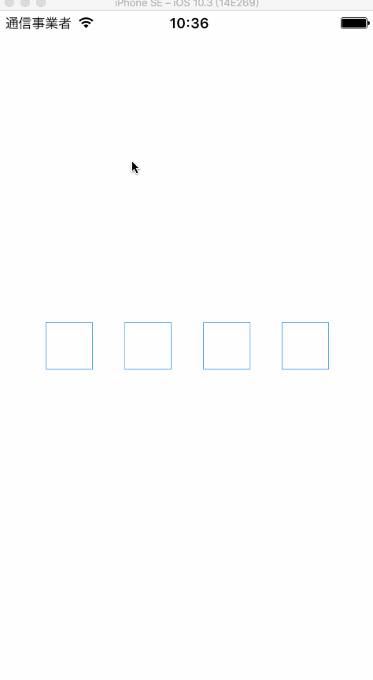

# ZHVerifyCodeField

ZHVerifyCodeField作为一个输入验证码的控件，支持代码和XIB进行设置。可以自定义设置输入框的数量

> 需要注意的是 如果自动设置输入框的间距 宽度必须大于高度x数量不然 代码无法运行

## 怎么安装

```
pod 'ZHVerifyCodeField'
```

## 怎么初始化

```swift
let field = ZHVerifyCodeField(number: 4, frame: CGRect(x: 50, y: 50, width: 200, height: 40))
field.dataSource = self
field.delegate = self
```

## 设置数据源

* 设置上下左右间距 默认为（0，0，0，0）

  ```swift
  optional func edgeInsets(_ filed:ZHVerifyCodeField) -> UIEdgeInsets
  ```

* 设置每一个输入框的间距 默认为自动计算 自动计算 width >= height * number

  ```swift
  optional func itemSpance(_ filed:ZHVerifyCodeField) -> CGFloat
  ```

## 设置代理

* 自定义每一个Cell

  ```swift
  optional func field(_ field:ZHVerifyCodeField, customCell:ZHVerifyCodeFieldCell, atIndex index:Int)
  ```

* 获取输入完毕的字符串

  ```swift
  optional func field(_ field:ZHVerifyCodeField, didCompletionInputCode text:String)
  ```

  ​

